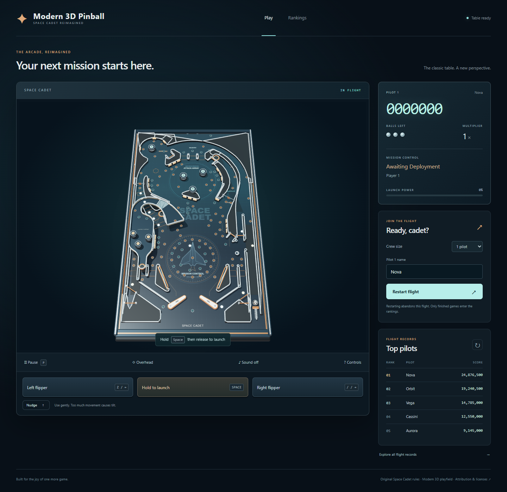
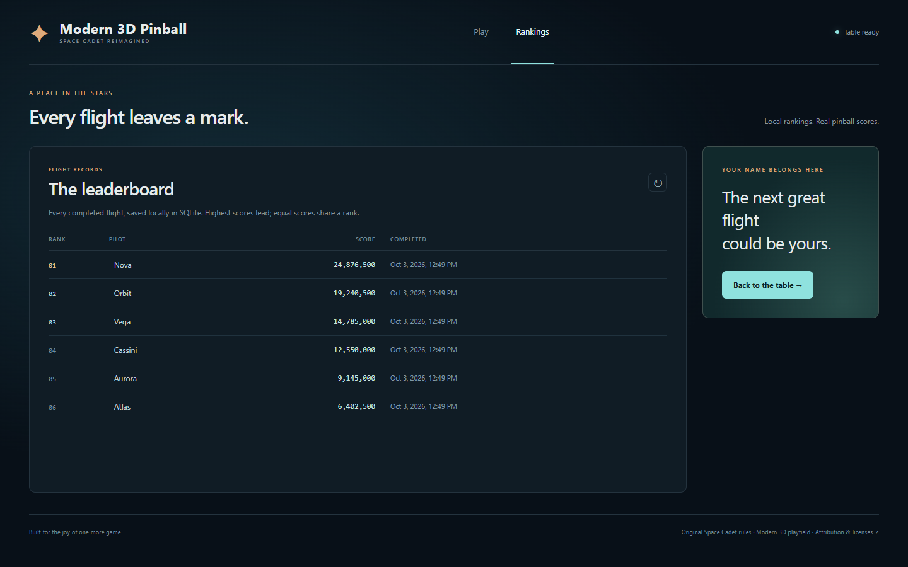
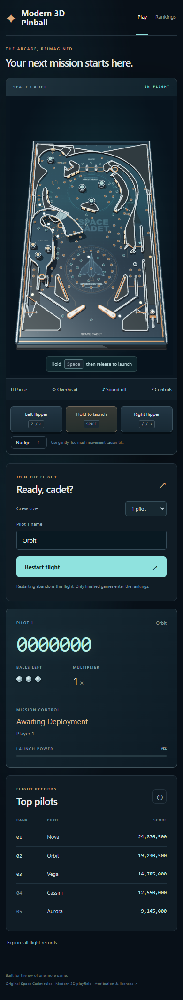

# Modern 3D Pinball

A playable React application using the preserved Space Cadet JavaScript engine,
with a Python FastAPI service and persistent SQLite rankings. The frontend owns
the simulation, Three.js table, keyboard/touch input, sound, and game lifecycle.
Python serves the original readable table data, creates game sessions, and saves
the final scores when all players finish their game.

`original-project/` is preserved as the reference implementation. It contains
JavaScript rather than Python; the new Python backend adapts its table data and
adds the ranking service rather than duplicating the physics in another language.

Runtime table data lives in `assets/table.json` at the repository root. The backend
serves this standalone copy through `/api/table`; running the app does not require
reading assets from `original-project/`.

## Screenshots

Desktop gameplay:



Persistent score rankings:



Mobile gameplay with touch controls:



These screenshots show the running application. Ranking entries are sample
scores created in an isolated temporary database for the captures.
After setup, regenerate the images with `python tools/capture_screenshots.py`.

## Quick start

Windows:

```powershell
.\setup.bat
.\run.bat
```

Linux/macOS:

```bash
bash setup.sh
bash run.sh
```

Install Python 3.10+, Node.js 20.19+, and npm 10+ (Node.js 24 is used in CI). Setup creates
and reuses this repository's `.venv`, installs the Python dependencies, and uses
the npm lockfiles to install frontend and browser-test dependencies. It creates
`.env` from `.env.example` only if `.env` does not already exist. No activation
command is needed, even if another Python environment is active.

Open the frontend URL printed by the runner, enter player names, and start a
game. The table supports one to four players taking turns. Finish all balls to
save the scores and receive your leaderboard positions. Closing the browser or
restarting a game abandons that game without publishing a partial score.

The default backend and frontend ports are `8000` and `5173`. The runner checks
both ports before launch and advances to the next available port when needed.
It prints the actual URLs selected for the session. Press Ctrl+C in the runner
terminal to stop both services and their child processes.

| Action | Keyboard |
| --- | --- |
| Left flipper | Z or Left arrow |
| Right flipper | Slash or Right arrow |
| Launch | Hold Space, then release |
| Nudge | X, period, or Up arrow |
| Pause/resume | P or Escape |
| New game | N or F2 |

On-screen hold/release buttons work on touch devices. Sound and camera controls
are available beside the table. Leaving the window pauses the game.

## Built application

```powershell
.\run.bat --production
```

```bash
bash run.sh --production
```

This builds `frontend/dist/` and starts one FastAPI service that serves both the
built React app and `/api` on the backend port, with reload disabled. Vite's
development server is used only by the development runner. See the official
[Vite deployment guide](https://vite.dev/guide/static-deploy.html) for the build
output and [FastAPI static files guide](https://fastapi.tiangolo.com/tutorial/static-files/)
for serving static assets.

For a server with an existing build, set `PINBALL_STATIC_DIR=frontend/dist` and
run the virtual environment's Python with:

```bash
python -m uvicorn backend.app.main:app --host 127.0.0.1 --port 8000
```

Place a public deployment behind your HTTPS reverse proxy, and keep the database
on persistent local storage. Back up SQLite using its backup API or stop the
service before copying its database and WAL files. There is no login system:
names identify entries rather than verified accounts. Scores are reported by
the browser; validation and idempotent submissions prevent malformed or duplicate
records, but this is a casual leaderboard, not an authoritative anti-cheat service.

## Configuration

Copy `.env.example` to `.env` to customize the preferred ports, bind address,
or database path. Environment variables already defined in the terminal take
precedence over values in `.env`.

| Variable | Default | Purpose |
| --- | --- | --- |
| `BACKEND_PORT` | `8000` | First backend port to try |
| `FRONTEND_PORT` | `5173` | First frontend port to try |
| `BACKEND_HOST` | `127.0.0.1` | Backend bind address |
| `PINBALL_DB_PATH` | `data/pinball.db` | Persistent SQLite database; relative to repository root |
| `CORS_ORIGINS` | Local frontend origins | Comma-separated permitted browser origins |
| `PINBALL_STATIC_DIR` | Unset | Serve a prebuilt frontend directory; set by production runner |
| `PINBALL_SESSION_TTL_SECONDS` | `86400` | Active-session lifetime; configurable from 60 seconds to seven days |

The development runner sets the Vite API proxy to the actual selected backend
port. To launch Vite separately, set `BACKEND_URL` to the Python service URL.
Local `.env` files, `.venv`, npm dependencies, build artifacts, and runtime
databases are ignored by Git. No external API keys are required.

## API

| Method | Path | Behavior |
| --- | --- | --- |
| `GET` | `/api/health` | Backend health check |
| `GET` | `/api/table` | Read the original table geometry and gameplay attributes |
| `POST` | `/api/games` | Start a session with `{"player_names":["Cadet"]}` |
| `POST` | `/api/games/{id}/complete` | Save `{"scores":[12000],"duration_ms":60000}` |
| `GET` | `/api/leaderboard?limit=10&offset=0` | Read scores, competition ranks, and total entry count |

Tied scores share a rank (for example 1, 1, 3), with deterministic ordering inside
a tie. SQLite transactions atomically save every player in a game. Retrying an
identical completed submission returns the existing result; changing its scores
returns a conflict. Rankings survive application restarts. Active sessions expire
after 24 hours by default; completed results remain available.

Interactive API documentation is available at the backend `/docs` URL.

## Tests and build

```powershell
.venv\Scripts\python.exe -m unittest discover -s backend\tests -v
.venv\Scripts\python.exe -m unittest discover -s tests -v
node --test original-project/tests/*.test.mjs
python tools/check_secrets.py
cd frontend
npm run typecheck
npm test
npm run build
cd ..\e2e
npm run typecheck
npm test
```

On Unix, use `.venv/bin/python` for the Python checks. The Playwright suite starts
FastAPI and Vite automatically and uses an isolated system-temp SQLite database,
then deletes it. It exercises gameplay controls, game-over submission, persistence,
retries, multiplayer, and mobile layout. Tests use Microsoft Edge locally on
Windows/Linux when available, and WebKit on macOS. For bundled Chromium instead,
run `npm run install:chromium` in `e2e` and set `PLAYWRIGHT_BROWSER=chromium`.

On a fresh macOS checkout, install the WebKit browser once before running the
tests:

```bash
cd e2e
npm run install:webkit
```

## Project layout

```text
original-project/         Preserved JavaScript engine, table data, and regression tests
assets/                   Standalone runtime table data served by the backend
backend/app/              FastAPI routes, configuration, schemas, table adapter, SQLite store
backend/tests/            API, ranking, concurrency, and persistence checks
frontend/src/             React shell, API client, game lifecycle and controls
frontend/src/pinball/      Adapted engine, Three.js renderer, and synthesized sound
e2e/                      Playwright checks with an isolated temporary database
tests/                    Cross-platform setup and process orchestration checks
data/                     Default persistent ranking database location (database ignored)
tools/check_secrets.py    Credential pattern audit that prints locations only
setup.py / setup.*        Project virtual environment and dependency installation
run.py / run.*            Development and built-application runners
```

The frontend adapter tests also exercise real multiplayer ball drains through
the original engine's game-over timers. Browser control hooks are enabled only
in development with `VITE_ENABLE_TEST_HOOKS=1`; production builds omit them.

The local productionization standard's PDF uploads, conversion ZIPs, and scratch
job directories are specific to converters. This game has no upload/conversion
pipeline. Durable ranking data belongs in SQLite; temporary test databases use
the operating system temp folder. A repeatable source credential audit is in
`secrets.md`. The CI workflow runs on Ubuntu.

See [THIRD_PARTY_NOTICES.md](THIRD_PARTY_NOTICES.md) and the preserved source's
[provenance](original-project/PROVENANCE.md) for engine and table attribution.
